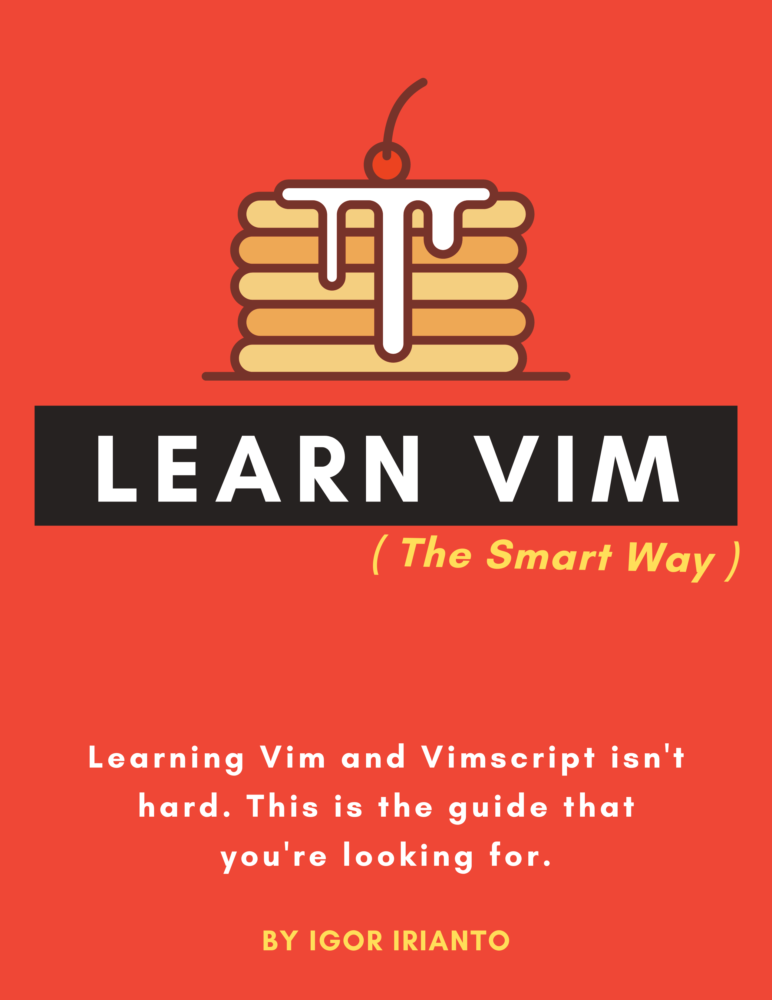

# Vim 똑똑하게 배우기

## 이게 뭔가요?

*Vim 똑똑하게 배우기*는 Vim의 좋은 부분들을 배우기 위한 가이드입니다.

Vim을 배울 수 있는 곳은 많습니다. `vimtutor`는 시작하기에 좋은 곳이고, `help` 매뉴얼에는 여러분에게 필요한 모든 레퍼런스가 담겨 있습니다. 하지만 일반적인 사용자는 `vimtutor`보다는 더 많은 것을, `help` 매뉴얼보다는 더 적은 것을 필요로 합니다. 이 가이드는 가장 유용한 Vim의 핵심 기능들만 조명하여 가능한 한 짧은 시간 안에 배울 수 있도록 함으로써 그 간극을 메우려고 합니다.

이 가이드는 초보자와 숙련된 Vimmer 모두를 위해 작성되었습니다. 광범위하고 간단한 개념으로 시작하여 구체적이고 고급 개념으로 끝납니다. 이미 숙련된 사용자라 할지라도 이 가이드를 처음부터 끝까지 읽어보시길 권합니다. 새로운 것을 배우게 될 테니까요!

## 더 많은 Vim 팁을 원해요!

업데이트, Vim 팁 등을 보려면 [@learnvim](https://twitter.com/learnvim)을 팔로우하세요.

## 이 프로젝트 후원하기

이 가이드는 항상 무료이며 앞으로도 그럴 것입니다.

이 프로젝트를 재정적으로 후원하고 싶으시다면, [Leanpub에서 이 가이드를 구매](https://leanpub.com/learnvim)하시거나 [커피 한 잔 사주세요](https://www.buymeacoffee.com/iggredible)!

## 목차

### 프롤로그

- [Ch 0 - 가장 먼저 읽어주세요](./ch00_read_this_first.md)

### 파트 1: Vim 똑똑하게 배우기

- [Ch 1 - Vim 시작하기](./ch01_starting_vim.md)
- [Ch 2 - 버퍼, 창, 탭](./ch02_buffers_windows_tabs.md)
- [Ch 3 - 파일 열기 및 검색](./ch03_searching_files.md)
- [Ch 4 - Vim 문법](./ch04_vim_grammar.md)
- [Ch 5 - 파일 내에서 이동하기](./ch05_moving_in_file.md)
- [Ch 6 - 입력 모드](./ch06_insert_mode.md)
- [Ch 7 - 점(.) 명령어](./ch07_the_dot_command.md)
- [Ch 8 - 레지스터](./ch08_registers.md)
- [Ch 9 - 매크로](./ch09_macros.md)
- [Ch 10 - 실행 취소](./ch10_undo.md)
- [Ch 11 - 비주얼 모드](./ch11_visual_mode.md)
- [Ch 12 - 검색 및 치환](./ch12_search_and_substitute.md)
- [Ch 13 - 전역 명령어](./ch13_the_global_command.md)
- [Ch 14 - 외부 명령어](./ch14_external_commands.md)
- [Ch 15 - 커맨드 라인 모드](./ch15_command-line_mode.md)
- [Ch 16 - 태그](./ch16_tags.md)
- [Ch 17 - 접기](./ch17_fold.md)
- [Ch 18 - Git](./ch18_git.md)
- [Ch 19 - 컴파일](./ch19_compile.md)
- [Ch 20 - 뷰, 세션, Viminfo](./ch20_views_sessions_viminfo.md)
- [Ch 21 - 다중 파일 작업](./ch21_multiple_file_operations.md)

### 파트 2: Vim 똑똑하게 커스터마이징하기

- [Ch 22 - Vimrc](./ch22_vimrc.md)
- [Ch 23 - Vim 패키지](./ch23_vim_packages.md)
- [Ch 24 - Vim 런타임](./ch24_vim_runtime.md)

### 파트 3: Vimscript 똑똑하게 배우기

- [Ch 25 - Vimscript 기본 데이터 타입](./ch25_vimscript_basic_data_types.md)
- [Ch 26 - Vimscript 조건문과 반복문](./ch26_vimscript_conditionals_and_loops.md)
- [Ch 27 - Vimscript 변수 범위](./ch27_vimscript_variable_scopes.md)
- [Ch 28 - Vimscript 함수](./ch28_vimscript_functions.md)
- [Ch 29 - 플러그인 예제: Titlecase 플러그인 작성하기](./ch29_plugin_example_writing-a-titlecase-plugin.md)

## 번역
- [Learn-Vim 中文翻译](https://wsdjeg.net/wiki/learn-vim/)(`zh-CN`)
- [Learn-Vim Spanish](https://github.com/victorhck/learn-Vim-es)(`es`)

## 라이선스 및 저작권
이곳의 자료는 모두 © 2020-2021 Igor Irianto의 저작물입니다.

 

이 저작물은 <a rel="license" href="http://creativecommons.org/licenses/by-nc-sa/4.0/">Creative Commons Attribution-NonCommercial-ShareAlike 4.0 International</a>에 따라 라이선스가 부여됩니다.